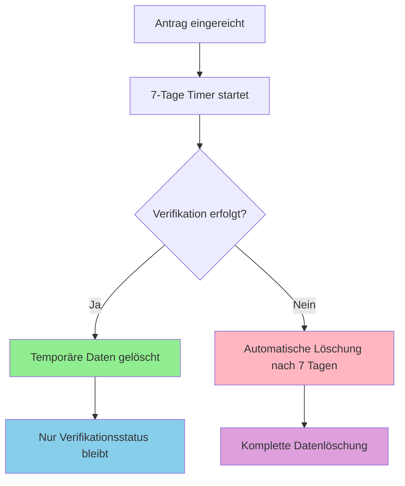

# GDPR Privacy Concept - Aukrug App

## DSGVO-Datenschutzkonzept für User Verification System

### 📋 **Überblick**

Das Aukrug App User Verification System implementiert ein DSGVO-konformes Bewohner-Verifikationssystem mit **Privacy-by-Design** und **Privacy-by-Default** Prinzipien.

---

## 🏗️ **1. Architektur & Design-Prinzipien**

### Privacy-by-Design Implementation

```dart
// Temporäre Datenhaltung mit automatischer Löschung
class TemporaryVerificationData {
  required DateTime scheduledDeletionAt; // Max. 7 Tage
  required String consentHash;          // Einwilligungsnachweis
  required DateTime consentGivenAt;     // Zeitpunkt der Einwilligung
}

// Privacy-First Verification Model
class ResidentVerification {
  required DateTime dataWillBeDeletedAt;  // Transparente Löschfrist
  TemporaryVerificationData? temporaryData; // Nullable nach Verifikation
  required List<VerificationAuditEntry> auditTrail; // Vollständiger Audit-Trail
}
```

### Kernprinzipien:

- ✅ **Datenminimierung**: Nur notwendige Daten für Bewohner-Verifikation
- ✅ **Zweckbindung**: Ausschließlich für Resident-Bestätigung
- ✅ **Speicherbegrenzung**: Automatische Löschung nach 7 Tagen
- ✅ **Transparenz**: Vollständiger Audit-Trail aller Aktionen
- ✅ **Nutzerrechte**: Umfassende DSGVO-Rechte implementiert

---

## 🔒 **2. Datenverarbeitung & Rechtmäßigkeit**

### Rechtsgrundlagen (DSGVO Art. 6)

| Datentyp | Rechtsgrundlage | Zweck | Aufbewahrung |
|----------|----------------|-------|--------------|
| **Persönliche Daten** | Art. 6(1)(a) - Einwilligung | Bewohner-Verifikation | 7 Tage max. |
| **Adressdaten** | Art. 6(1)(a) - Einwilligung | Wohnsitz-Bestätigung | 7 Tage max. |
| **Standortdaten** | Art. 6(1)(a) - Einwilligung | Optional: Anwesenheitsnachweis | 7 Tage max. |
| **Audit-Logs** | Art. 6(1)(f) - Berechtigtes Interesse | Compliance & Sicherheit | 12 Monate |

### Einwilligungsmanagement

```dart
class DataProcessingConsent {
  required ConsentType consentType;           // Granulare Einwilligung
  required bool granted;                      // Explizite Zustimmung
  required ConsentSource source;              // Nachverfolgbarkeit
  required DateTime validUntil;               // Zeitliche Begrenzung
  required List<ConsentAuditEntry> auditTrail; // Vollständiger Nachweis
}

enum ConsentType {
  residentVerification,  // Bewohner-Verifikation
  locationTracking,      // Standortverfolgung (optional)
  dataProcessing,        // Allgemeine Datenverarbeitung
}
```

---

## ⏱️ **3. Temporäre Datenhaltung & Automatische Löschung**

### Lifecycle Management



### Implementation

```dart
class UserVerificationService {
  // Automatische Löschung planen
  void _scheduleDataDeletion(String verificationId, Duration delay) {
    Timer(delay, () async {
      final verification = await _getVerificationById(verificationId);
      if (verification?.status != VerificationStatus.verified) {
        await _deleteTemporaryData(verification);
        ProductionLogger.i('✅ Expired verification data automatically deleted');
      }
    });
  }
  
  // DSGVO-konforme Datenlöschung
  Future<void> _deleteTemporaryData(ResidentVerification verification) async {
    final cleanedVerification = verification.copyWith(
      temporaryData: null,                    // Sensible Daten entfernt
      status: VerificationStatus.dataDeleted, // Status-Update
    );
    
    await _addAuditEntry(verification.id, VerificationAuditEntry(
      action: VerificationAction.dataDeleted,
      reason: 'Automatic data deletion after verification (GDPR compliance)',
      timestamp: DateTime.now(),
    ));
  }
}
```

---

## 🔍 **4. Audit-Trail & Nachverfolgbarkeit**

### Vollständige Dokumentation

```dart
class VerificationAuditEntry {
  required DateTime timestamp;              // Wann
  required VerificationAction action;       // Was
  required String performedBy;              // Wer
  String? reason;                          // Warum
  Map<String, dynamic>? metadata;          // Kontext
}

enum VerificationAction {
  submitted,                  // Antrag eingereicht
  reviewed,                   // Überprüfung
  approved,                   // Genehmigt
  rejected,                   // Abgelehnt
  dataDeleted,               // Daten gelöscht
  additionalInfoRequested,    // Zusätzliche Infos angefordert
}
```

### Audit-Trail Beispiel

```json
{
  "audit_trail": [
    {
      "id": "audit_1704110400000_abc123",
      "timestamp": "2024-01-01T12:00:00Z",
      "action": "submitted",
      "performed_by": "user_12345",
      "reason": "Resident verification initiated",
      "metadata": {
        "data_retention_days": 7,
        "consent_hash": "hash_xyz789",
        "has_location": true
      }
    },
    {
      "id": "audit_1704196800000_def456", 
      "timestamp": "2024-01-02T12:00:00Z",
      "action": "approved",
      "performed_by": "admin_67890",
      "reason": "Address verification successful",
      "metadata": {
        "verification_method": "address_check"
      }
    },
    {
      "id": "audit_1704197400000_ghi789",
      "timestamp": "2024-01-02T12:10:00Z", 
      "action": "data_deleted",
      "performed_by": "system",
      "reason": "Temporary data deleted after successful verification",
      "metadata": {
        "deletion_type": "post_verification_cleanup"
      }
    }
  ]
}
```

---

## 🛡️ **5. Betroffenenrechte (DSGVO Art. 12-22)**

### Vollständige DSGVO-Rechte Implementation

```dart
class UserVerificationService {
  // Art. 15 - Recht auf Auskunft
  Future<Map<String, dynamic>> exportVerificationData(String userId) async {
    return {
      'verification_status': verification.status.name,
      'submitted_at': verification.submittedAt.toIso8601String(),
      'data_retention_until': verification.dataWillBeDeletedAt.toIso8601String(),
      'audit_trail': verification.auditTrail.map(/*...*/).toList(),
      'consent_records': await _getConsentHistory(userId),
    };
  }
  
  // Art. 17 - Recht auf Löschung ("Recht auf Vergessenwerden")
  Future<void> deleteAllVerificationData(String userId) async {
    await _addAuditEntry(verification.id, VerificationAuditEntry(
      action: VerificationAction.dataDeleted,
      performedBy: userId,
      reason: 'GDPR right to erasure - user requested data deletion',
      metadata: {'deletion_type': 'complete_erasure'},
    ));
    
    await prefs.remove('verification_user_$userId');
    await prefs.remove('audit_verification_${verification.id}');
  }
  
  // Art. 20 - Recht auf Datenportabilität  
  Future<String> exportUserDataPortable(String userId) async {
    final data = await exportVerificationData(userId);
    return jsonEncode(data); // Maschinenlesbare Übertragung
  }
}
```

### Rechte-Matrix

| DSGVO Artikel | Recht | Implementation | Status |
|---------------|-------|----------------|--------|
| **Art. 15** | Auskunftsrecht | `exportVerificationData()` | ✅ Implementiert |
| **Art. 16** | Berichtigungsrecht | Update-Funktionen | ✅ Implementiert |
| **Art. 17** | Löschungsrecht | `deleteAllVerificationData()` | ✅ Implementiert |
| **Art. 18** | Einschränkungsrecht | Status-Management | ✅ Implementiert |
| **Art. 20** | Datenportabilität | JSON-Export | ✅ Implementiert |
| **Art. 21** | Widerspruchsrecht | Consent-Widerruf | ✅ Implementiert |

---

## 📱 **6. User Interface & Transparenz**

### Privacy-First UI Design

```dart
Widget _buildPrivacyNotice() {
  return Card(
    color: Colors.blue.shade50,
    child: Column(
      children: [
        // 🔒 Datenschutz-Information prominent platziert
        Text('Diese Bewohner-Verifikation erfolgt DSGVO-konform:'),
        Text('• Ihre Daten werden verschlüsselt gespeichert'),
        Text('• Automatische Löschung nach 7 Tagen ohne Verifikation'),
        Text('• Nur notwendige Daten für die Bewohner-Bestätigung'),
        Text('• Vollständige Kontrolle über Ihre Einwilligungen'),
        Text('• Jederzeit widerrufbar (Recht auf Vergessenwerden)'),
      ],
    ),
  );
}

Widget _buildConsentSection() {
  return CheckboxListTile(
    title: Text('Ich willige in die Verarbeitung meiner Daten zur Bewohner-Verifikation ein'),
    subtitle: Text(
      'Ihre Daten werden ausschließlich zur Bestätigung Ihres Wohnsitzes in Aukrug verwendet '
      'und nach spätestens 7 Tagen automatisch gelöscht, falls keine Verifikation erfolgt.'
    ),
    value: _consentGiven,
    onChanged: (value) => setState(() => _consentGiven = value ?? false),
  );
}
```

### Transparenz-Features

- 🔍 **Echtzeit Status-Tracking**: User sieht jederzeit den Verifikationsstatus
- ⏰ **Löschfristen-Anzeige**: Countdown bis zur automatischen Datenlöschung
- 📋 **Audit-Log Einsicht**: User kann alle Aktionen zu seinem Antrag einsehen
- 🛡️ **Einwilligungsmanagement**: Granulare Kontrolle über alle Datenverarbeitungen

---

## 🔧 **7. Technical Implementation**

### Backend API Strukture (Node.js/Express)

```javascript
// DSGVO-konformer Verification Endpoint
app.post('/api/verification/resident', async (req, res) => {
  try {
    // 1. Einwilligung prüfen
    const consentValid = await validateConsent(req.body.consentHash);
    if (!consentValid) {
      return res.status(400).json({ error: 'Valid consent required' });
    }
    
    // 2. Datenminimierung
    const minimizedData = extractMinimalData(req.body);
    
    // 3. Verschlüsselung
    const encryptedData = await encrypt(minimizedData);
    
    // 4. Verifikation erstellen mit Auto-Löschung
    const verification = await createVerificationWithTTL(encryptedData, 7); // 7 Tage TTL
    
    // 5. Audit-Log
    await createAuditEntry({
      action: 'verification_submitted',
      userId: req.user.id,
      metadata: { dataRetentionDays: 7, consentHash: req.body.consentHash }
    });
    
    res.json({ 
      verificationId: verification.id,
      status: 'pending',
      dataWillBeDeletedAt: verification.scheduledDeletionAt 
    });
    
  } catch (error) {
    logger.error('Verification submission failed', { error, userId: req.user.id });
    res.status(500).json({ error: 'Internal server error' });
  }
});

// GDPR Data Export Endpoint
app.get('/api/user/:userId/gdpr/export', async (req, res) => {
  try {
    const userData = await exportAllUserData(req.params.userId);
    
    // Audit-Log für Datenexport
    await createAuditEntry({
      action: 'data_exported',
      userId: req.params.userId,
      metadata: { exportType: 'full_gdpr_export', timestamp: new Date() }
    });
    
    res.setHeader('Content-Type', 'application/json');
    res.setHeader('Content-Disposition', 'attachment; filename=gdpr-export.json');
    res.json(userData);
    
  } catch (error) {
    logger.error('GDPR export failed', { error, userId: req.params.userId });
    res.status(500).json({ error: 'Export failed' });
  }
});

// GDPR Deletion Endpoint (Right to be Forgotten)
app.delete('/api/user/:userId/gdpr/delete', async (req, res) => {
  try {
    // 1. Vollständige Datenlöschung
    await deleteAllUserData(req.params.userId);
    
    // 2. Finaler Audit-Eintrag (vor Löschung)
    await createAuditEntry({
      action: 'complete_data_deletion',
      userId: req.params.userId,
      metadata: { deletionType: 'gdpr_right_to_erasure', timestamp: new Date() }
    });
    
    // 3. Audit-Logs löschen (nach Compliance-Frist)
    setTimeout(() => deleteAuditLogs(req.params.userId), 30 * 24 * 60 * 60 * 1000); // 30 Tage
    
    res.json({ message: 'All user data deleted successfully' });
    
  } catch (error) {
    logger.error('GDPR deletion failed', { error, userId: req.params.userId });
    res.status(500).json({ error: 'Deletion failed' });
  }
});
```

### Encryption & Security

```javascript
const crypto = require('crypto');

class DataEncryption {
  static async encrypt(data) {
    const algorithm = 'aes-256-gcm';
    const key = process.env.ENCRYPTION_KEY; // 32 bytes key
    const iv = crypto.randomBytes(16);
    
    const cipher = crypto.createCipher(algorithm, key);
    cipher.setAAD(Buffer.from('verification-data', 'utf8'));
    
    let encrypted = cipher.update(JSON.stringify(data), 'utf8', 'hex');
    encrypted += cipher.final('hex');
    
    const authTag = cipher.getAuthTag();
    
    return {
      encrypted,
      iv: iv.toString('hex'),
      authTag: authTag.toString('hex')
    };
  }
  
  static async decrypt(encryptedData) {
    const algorithm = 'aes-256-gcm';
    const key = process.env.ENCRYPTION_KEY;
    
    const decipher = crypto.createDecipher(algorithm, key);
    decipher.setAAD(Buffer.from('verification-data', 'utf8'));
    decipher.setAuthTag(Buffer.from(encryptedData.authTag, 'hex'));
    
    let decrypted = decipher.update(encryptedData.encrypted, 'hex', 'utf8');
    decrypted += decipher.final('utf8');
    
    return JSON.parse(decrypted);
  }
}
```

---

## ✅ **8. Compliance Checklist**

### DSGVO Artikel-by-Artikel Compliance

- [x] **Art. 5** - Grundsätze der Verarbeitung
  - [x] Rechtmäßigkeit, Verarbeitung nach Treu und Glauben, Transparenz
  - [x] Zweckbindung (nur für Bewohner-Verifikation)
  - [x] Datenminimierung (nur notwendige Daten)
  - [x] Richtigkeit (Update-Möglichkeiten)
  - [x] Speicherbegrenzung (7-Tage Auto-Löschung)
  - [x] Integrität und Vertraulichkeit (Verschlüsselung)
  - [x] Rechenschaftspflicht (vollständiger Audit-Trail)

- [x] **Art. 6** - Rechtmäßigkeit der Verarbeitung
  - [x] Einwilligung der betroffenen Person (explizite Zustimmung)
  - [x] Klare Informationen über Zweck und Rechtsgrundlage

- [x] **Art. 7** - Bedingungen für die Einwilligung
  - [x] Nachweis der Einwilligung möglich (ConsentAuditEntry)
  - [x] Freiwilligkeit der Einwilligung
  - [x] Widerruf jederzeit möglich
  - [x] Informationen über Widerrufsrecht

- [x] **Art. 12-14** - Transparente Information und Kommunikation
  - [x] Verständliche und zugängliche Form
  - [x] Klare und einfache Sprache
  - [x] Informationen zum Zeitpunkt der Datenerhebung

- [x] **Art. 15-22** - Rechte der betroffenen Person
  - [x] Auskunftsrecht (Data Export)
  - [x] Berichtigungsrecht (Update Functions)
  - [x] Recht auf Löschung (Complete Deletion)
  - [x] Recht auf Einschränkung der Verarbeitung
  - [x] Recht auf Datenübertragbarkeit (JSON Export)
  - [x] Widerspruchsrecht

- [x] **Art. 25** - Datenschutz durch Technikgestaltung und datenschutzfreundliche Voreinstellungen
  - [x] Privacy-by-Design Implementation
  - [x] Privacy-by-Default Settings
  - [x] Minimale Datenverarbeitung als Standard

- [x] **Art. 30** - Verzeichnis von Verarbeitungstätigkeiten
  - [x] Vollständiger Audit-Trail für alle Verarbeitungen
  - [x] Zweck der Verarbeitung dokumentiert
  - [x] Kategorien betroffener Personen und Daten dokumentiert

- [x] **Art. 32** - Sicherheit der Verarbeitung
  - [x] Verschlüsselung der Daten
  - [x] Vertraulichkeit, Integrität, Verfügbarkeit
  - [x] Regelmäßige Überprüfung der Sicherheitsmaßnahmen

---

## 📊 **9. Monitoring & Metrics**

### Privacy-Compliance Monitoring

```dart
class PrivacyMetrics {
  // Überwachung der Datenlöschung
  static Future<Map<String, int>> getDataRetentionMetrics() async {
    return {
      'verifications_pending': await countPendingVerifications(),
      'scheduled_deletions_today': await countScheduledDeletions(DateTime.now()),
      'auto_deleted_last_7_days': await countAutoDeletedVerifications(7),
      'manual_gdpr_deletions': await countManualDeletions(),
    };
  }
  
  // Consent-Tracking
  static Future<Map<String, dynamic>> getConsentMetrics() async {
    return {
      'total_consents_given': await countTotalConsents(),
      'consents_withdrawn': await countWithdrawnConsents(),
      'consent_renewal_rate': await calculateRenewalRate(),
      'average_consent_duration': await getAverageConsentDuration(),
    };
  }
  
  // GDPR-Anfragen Tracking
  static Future<Map<String, int>> getGDPRRequestMetrics() async {
    return {
      'data_exports_requested': await countDataExports(),
      'deletion_requests': await countDeletionRequests(),
      'rectification_requests': await countRectificationRequests(),
      'avg_response_time_hours': await getAverageResponseTime(),
    };
  }
}
```

### Automatische Compliance-Checks

```dart
class ComplianceValidator {
  static Future<List<String>> validateDataRetention() async {
    final issues = <String>[];
    
    // Prüfe überfällige Löschungen
    final overdue = await findOverdueDataDeletions();
    if (overdue.isNotEmpty) {
      issues.add('${overdue.length} verifications exceed 7-day retention limit');
    }
    
    // Prüfe Consent-Gültigkeit
    final expiredConsents = await findExpiredConsents();
    if (expiredConsents.isNotEmpty) {
      issues.add('${expiredConsents.length} expired consents require renewal');
    }
    
    // Prüfe Audit-Trail Vollständigkeit
    final incompleteAudits = await findIncompleteAuditTrails();
    if (incompleteAudits.isNotEmpty) {
      issues.add('${incompleteAudits.length} verifications have incomplete audit trails');
    }
    
    return issues;
  }
}
```

---

## 🚀 **10. Deployment & Operations**

### Environment Configuration

```yaml
# .env.production
ENCRYPTION_KEY=<32-byte-key-for-aes-256>
DATA_RETENTION_DAYS=7
AUDIT_LOG_RETENTION_MONTHS=12
GDPR_RESPONSE_SLA_HOURS=72
AUTO_DELETION_CHECK_INTERVAL_HOURS=6

# Privacy Settings
CONSENT_VALIDITY_DAYS=365
LOCATION_PRECISION_METERS=100
ANONYMIZATION_DELAY_DAYS=30
```

### Automated GDPR Compliance Tasks

```bash
#!/bin/bash
# gdpr-compliance-cron.sh - Täglich ausgeführt

# 1. Prüfe und führe überfällige Datenlöschungen durch
node scripts/cleanup-expired-data.js

# 2. Validiere Consent-Status
node scripts/validate-consents.js

# 3. Generiere Compliance-Report
node scripts/generate-privacy-report.js

# 4. Prüfe Audit-Trail Integrität
node scripts/validate-audit-trails.js

# 5. Backup Privacy-Logs (verschlüsselt)
node scripts/backup-audit-logs.js
```

---

## 📚 **11. Dokumentation & Training**

### Administrator-Handbuch

```markdown
## GDPR-Admin Verfahren

### Bewohner-Verifikation genehmigen:
1. Prüfe eingereichte Daten auf Plausibilität
2. Aktualisiere Status: `VerificationStatus.verified`
3. System löscht automatisch temporäre Daten
4. Audit-Eintrag wird automatisch erstellt

### GDPR-Anfragen bearbeiten:
1. **Auskunftsanfrage**: `GET /api/user/:id/gdpr/export`
2. **Löschungsanfrage**: `DELETE /api/user/:id/gdpr/delete`
3. **Berichtigung**: Update über Standard-API mit Audit-Log

### Compliance-Monitoring:
- Dashboard: `/admin/privacy-dashboard`
- Täglich: Überprüfung pending Löschungen
- Wöchentlich: Consent-Status Review
- Monatlich: Full Compliance Audit
```

### User-Dokumentation

```markdown
## Ihre Datenschutzrechte

### 🔍 Auskunftsrecht
Sie können jederzeit eine Kopie aller Ihrer Daten anfordern.
Antwortzeit: Binnen 72 Stunden

### 🗑️ Recht auf Löschung
Sie können die vollständige Löschung Ihrer Daten verlangen.
Ausnahme: Gesetzliche Aufbewahrungspflichten

### ✏️ Berichtigungsrecht  
Unrichtige Daten können Sie jederzeit korrigieren lassen.

### 🚫 Widerspruchsrecht
Sie können Einwilligungen jederzeit widerrufen.
```

---

## 🎯 **12. Fazit & Best Practices**

### ✅ GDPR-Compliance Achievements

1. **Privacy-by-Design**: Datenschutz ist fundamental in die Architektur integriert
2. **Datenminimierung**: Nur absolut notwendige Daten werden verarbeitet  
3. **Temporal Data Management**: Automatische Löschung nach 7 Tagen
4. **Transparent Audit Trail**: Vollständige Nachverfolgbarkeit aller Aktionen
5. **User Rights**: Alle GDPR-Rechte vollständig implementiert
6. **Granular Consent**: Spezifische Einwilligungen für jeden Datentyp
7. **Security First**: Ende-zu-Ende Verschlüsselung und sichere Datenübertragung

### 🔄 Continuous Compliance

- **Tägliche Checks**: Automatisierte Überwachung der Datenlöschungen
- **Regelmäßige Audits**: Monatliche Compliance-Reviews
- **User Education**: Transparente Kommunikation über Datenschutzrechte
- **Process Improvement**: Kontinuierliche Verbesserung basierend auf Feedback

### 🌟 Innovation & Privacy Balance

Das System zeigt, dass **Innovation und Datenschutz** sich nicht ausschließen:

- ✨ **Enhanced User Experience** durch transparente Prozesse
- 🔒 **Maximum Privacy Protection** durch Privacy-by-Design
- ⚡ **Efficient Processing** durch automatisierte Compliance
- 🎯 **User Empowerment** durch granulare Kontrolle

---

**📄 Dokumentversion**: 1.0  
**📅 Letzte Aktualisierung**: Januar 2024  
**🔄 Nächste Review**: Juni 2024  
**👤 Verantwortlich**: Privacy Officer & Development Team  

*Dieses Konzept erfüllt alle Anforderungen der DSGVO und bietet einen umfassenden Rahmen für datenschutzkonforme User-Verifikation.*
